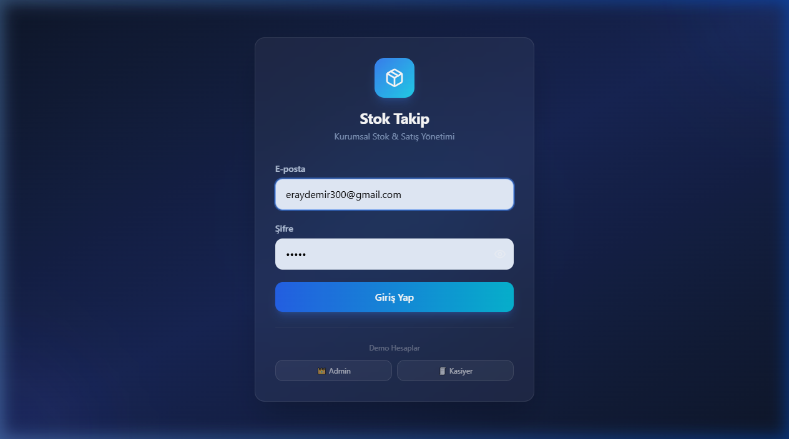
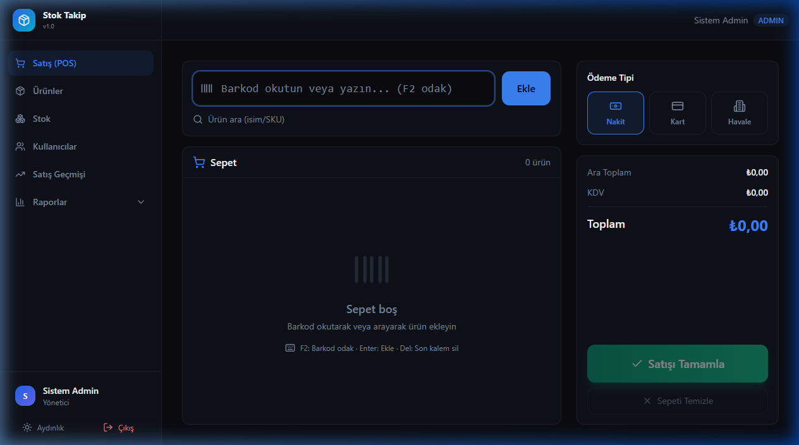
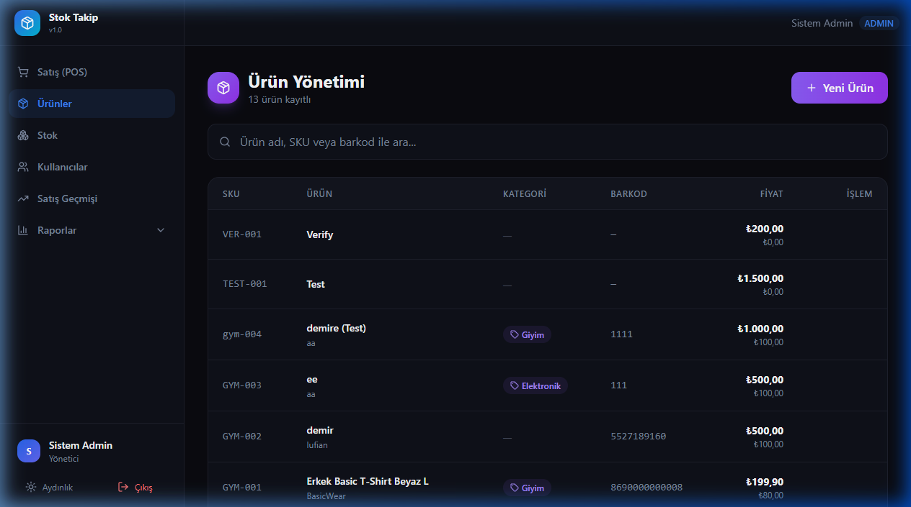
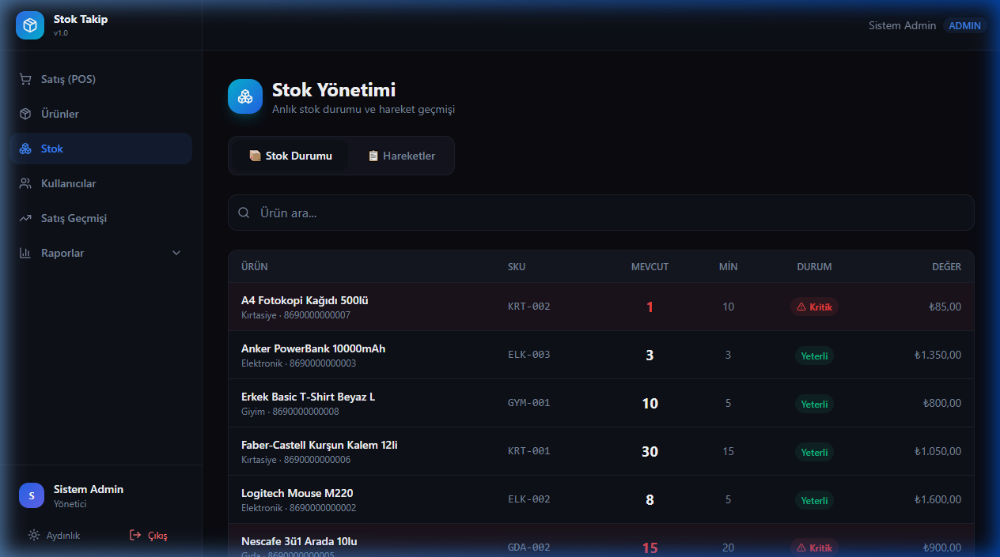
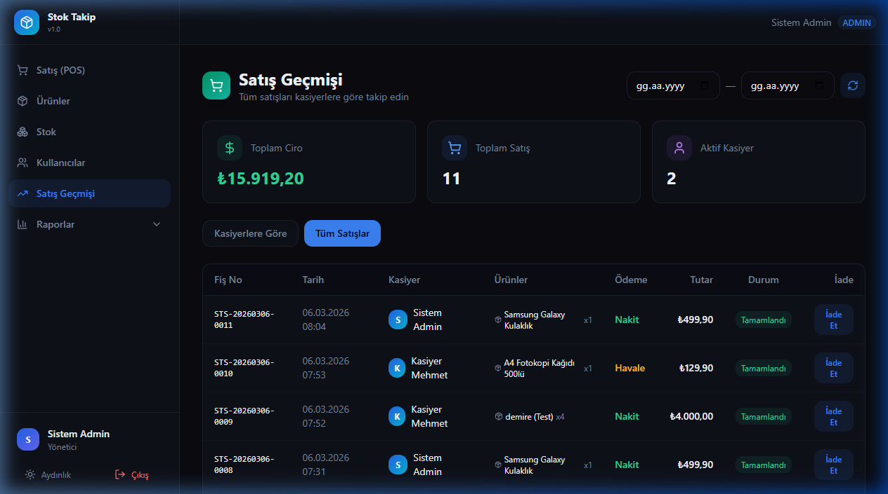
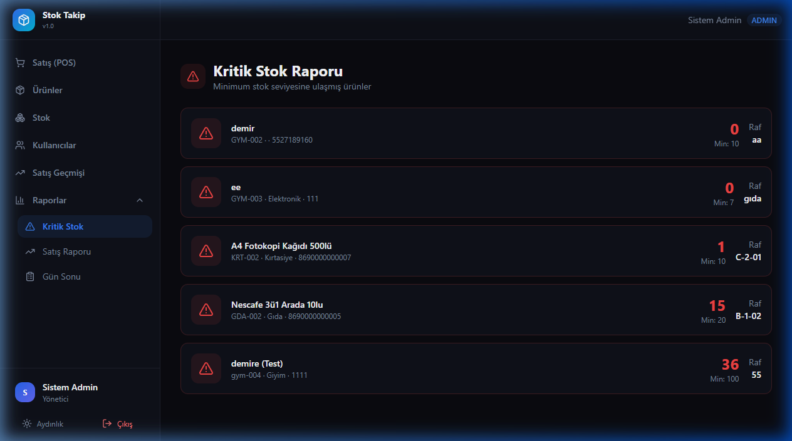
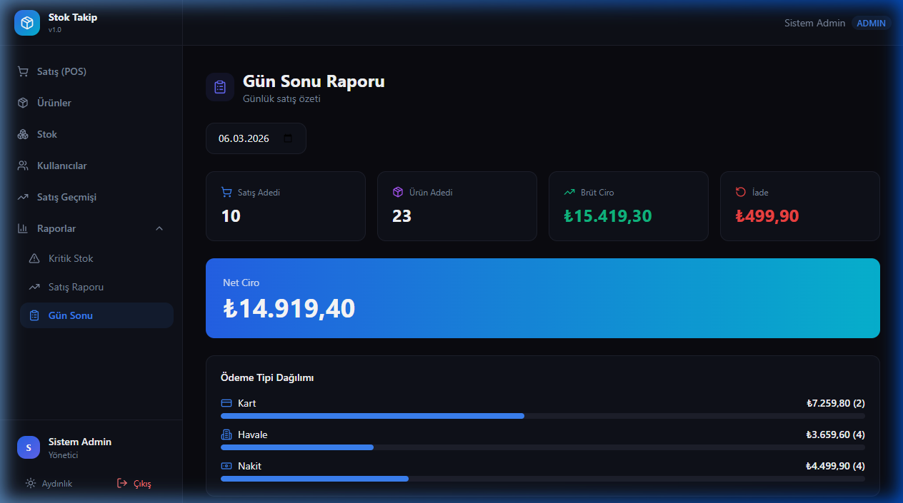
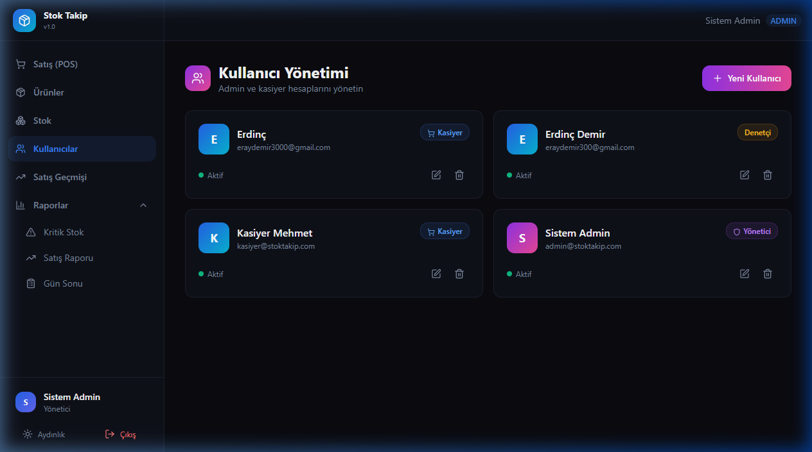
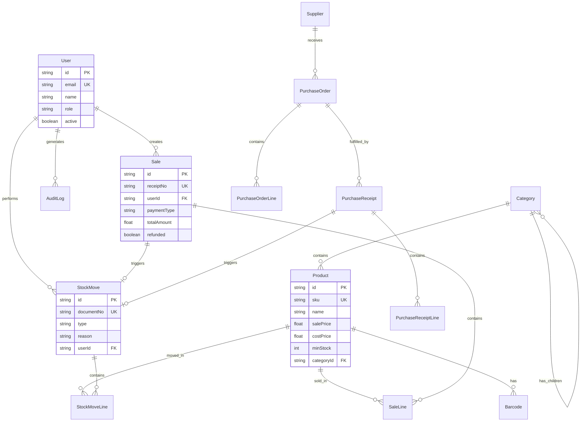

<div align="center">

# 🏪 Stok Takip — Kurumsal Stok ve Satış Yönetimi

**Profesyonel stok takip, satış noktası (POS) ve raporlama sistemi**

[](https://nextjs.org/)
[](https://nestjs.com/)
[](https://prisma.io/)
[](https://typescriptlang.org/)
[](https://sqlite.org/)
[](LICENSE)

<br/>

*Modern, hızlı ve kullanıcı dostu stok takip uygulaması. Küçük ve orta ölçekli işletmeler için tasarlandı.*

</div>

---
## 📸 Ekran Görüntüleri

### 🔐 Giriş Ekranı



Demo hesaplar ile hızlı giriş yapabilirsiniz. Admin ve Kasiyer rolleri mevcuttur.

---

### 🛒 Satış Noktası (POS)



Barkod okuyucu desteği, hızlı ürün arama, anlık sepet yönetimi ve nakit/kart/havale ödeme seçenekleri.

---

### 📦 Ürün Yönetimi



Ürün ekleme, düzenleme, silme. SKU, barkod, kategori, fiyat ve stok bilgileri tek ekranda.

---

### 📊 Stok Durumu



Anlık stok seviyeleri, kritik stok uyarıları ve stok hareket geçmişi.

---

### 📋 Satış Geçmişi & İade



Tüm satışlar, kasiyere göre gruplama, tarih filtreleme ve tek tıkla iade işlemi.

---

### ⚠️ Kritik Stok Raporu



Minimum stok seviyesinin altına düşen ürünler otomatik listelenir.

---

### 📈 Gün Sonu Raporu



Günlük satış adedi, brüt ciro, iade tutarı, net ciro ve ödeme tipi dağılımı.

---

### 👥 Kullanıcı Yönetimi



Admin panelinden kullanıcı ekleme, rol atama (Admin/Kasiyer) ve hesap yönetimi.
---

## ✨ Özellikler

### 🛒 Satış Noktası (POS)
- ⚡ **Barkod okuyucu** desteği ile hızlı ürün ekleme
- 🔍 İsim veya SKU ile **akıllı ürün arama**
- 🛒 Dinamik **sepet yönetimi** (miktar artır/azalt, sil)
- 💳 **Nakit, Kart, Havale** ödeme tipleri
- 🧾 Otomatik **fiş numarası** oluşturma
- ⌨️ **Klavye kısayolları** (F2: Barkod odak, Enter: Ekle, Del: Sil)

### 📦 Ürün Yönetimi
- ➕ Ürün ekleme ile birlikte **otomatik stok hareketi** oluşturma
- ✏️ Ürün düzenleme (fiyat, kategori, marka, raf konumu)
- 🏷️ **Çoklu barkod** desteği
- 📁 **Kategori** sistemi (Elektronik, Gıda, Kırtasiye, Giyim vb.)
- 🔍 SKU, isim ve barkod ile filtreleme

### 📊 Stok Yönetimi
- 📈 Anlık **stok seviyeleri** takibi
- ⚠️ **Kritik stok uyarıları** (minimum seviye altı otomatik tespit)
- 📋 **Stok hareket geçmişi** (giriş, çıkış, iade, sayım)
- 🔄 Manuel **stok düzeltme** (sayım farkı giderme)

### 💰 Satış & İade
- 📜 Detaylı **satış geçmişi** (fiş no, tarih, kasiyer, ürünler, tutar)
- 👤 **Kasiyere göre** satış gruplama
- 📅 **Tarih aralığı** filtreleme
- ↩️ Tek tıkla **iade** işlemi (stok otomatik güncellenir)
- 💵 KDV hesaplaması

### 📈 Raporlama
- ⚠️ **Kritik Stok Raporu** — minimum seviyenin altındaki ürünler
- 📊 **Satış Raporu** — dönemsel özet
- 🏆 **En Çok Satanlar** — popüler ürünler
- 📅 **Gün Sonu Raporu** — günlük ciro, iade, ödeme dağılımı
- 💎 **Stok Değeri** — toplam envanter değeri

### 👥 Kullanıcı Yönetimi
- 🔐 **JWT kimlik doğrulama**
- 👑 **Rol tabanlı yetkilendirme** (Admin, Kasiyer, Denetçi)
- 👤 Kullanıcı ekleme, düzenleme, devre dışı bırakma
- 📊 Kasiyere göre satış performansı

---

## 🏗️ Teknoloji Altyapısı

### Frontend
| Teknoloji | Açıklama |
|-----------|----------|
| **Next.js 15** | React tabanlı fullstack framework |
| **TypeScript** | Tip güvenli JavaScript |
| **Tailwind CSS** | Utility-first CSS framework |
| **Lucide React** | Modern ikon kütüphanesi |

### Backend
| Teknoloji | Açıklama |
|-----------|----------|
| **NestJS 10** | Progressive Node.js framework |
| **Prisma ORM** | Type-safe veritabanı erişimi |
| **SQLite** | Hafif, gömülü veritabanı |
| **JWT** | Token tabanlı kimlik doğrulama |
| **bcrypt** | Şifre hash'leme |

### Monorepo
| Teknoloji | Açıklama |
|-----------|----------|
| **pnpm** | Hızlı paket yöneticisi |
| **Turborepo** | Monorepo build sistemi |

---

## 📐 Veritabanı Şeması



---

## 🚀 Kurulum

### Gereksinimler

- **Node.js** 18+
- **pnpm** 8+ (`npm install -g pnpm`)

### 1. Projeyi Klonlayın

```bash
git clone https://github.com/kullanici/stok-takip.git
cd stok-takip
```

### 2. Bağımlılıkları Yükleyin

```bash
pnpm install
```

### 3. Ortam Değişkenlerini Ayarlayın

```bash
cp apps/api/.env.example apps/api/.env
```

`.env` dosyasını düzenleyin:

```env
DATABASE_URL="file:./dev.db"
JWT_SECRET="super-secret-key-change-in-production"
API_PORT=3001
```

### 4. Veritabanını Oluşturun

```bash
cd apps/api
npx prisma migrate dev --name init
npx prisma db seed
cd ../..
```

### 5. Uygulamayı Başlatın

```bash
pnpm dev
```

🌐 **Frontend:** http://localhost:3000  
🔧 **Backend API:** http://localhost:3001

### 6. Demo Hesaplar ile Giriş

| Rol | E-posta | Şifre |
|-----|---------|-------|
| 👑 Admin | admin@stoktakip.com | admin123 |
| 💼 Kasiyer | kasiyer@stoktakip.com | kasiyer123 |

---

## 📁 Proje Yapısı

```
stok-takip/
├── apps/
│   ├── api/                    # Backend (NestJS)
│   │   ├── prisma/
│   │   │   ├── schema.prisma   # Veritabanı şeması
│   │   │   ├── seed.ts         # Demo verileri
│   │   │   └── dev.db          # SQLite veritabanı
│   │   └── src/
│   │       ├── auth/           # Kimlik doğrulama (JWT)
│   │       ├── products/       # Ürün CRUD
│   │       ├── sales/          # Satış & iade
│   │       ├── stock/          # Stok yönetimi
│   │       ├── reports/        # Raporlama
│   │       ├── categories/     # Kategori yönetimi
│   │       ├── users/          # Kullanıcı yönetimi
│   │       ├── suppliers/      # Tedarikçi yönetimi
│   │       ├── purchases/      # Satın alma
│   │       └── prisma/         # Prisma servisi
│   │
│   └── web/                    # Frontend (Next.js)
│       └── src/
│           ├── app/
│           │   ├── dashboard/
│           │   │   ├── pos/            # Satış noktası
│           │   │   ├── products/       # Ürünler
│           │   │   ├── stock/          # Stok
│           │   │   ├── sales-history/  # Satış geçmişi
│           │   │   ├── users/          # Kullanıcılar
│           │   │   └── reports/        # Raporlar
│           │   └── page.tsx            # Giriş sayfası
│           ├── lib/
│           │   ├── api.ts              # API istemcisi
│           │   ├── auth-context.tsx     # Auth context
│           │   └── utils.ts            # Yardımcı fonksiyonlar
│           └── components/             # UI bileşenleri
│
├── docs/screenshots/           # Ekran görüntüleri
├── package.json
├── pnpm-workspace.yaml
└── turbo.json
```

---

## 🔑 API Endpoints

### Auth
| Method | Endpoint | Açıklama |
|--------|----------|----------|
| `POST` | `/api/auth/login` | Giriş yap |
| `GET` | `/api/auth/me` | Mevcut kullanıcı bilgisi |

### Products
| Method | Endpoint | Açıklama |
|--------|----------|----------|
| `GET` | `/api/products` | Ürün listele (sayfalı, aranabilir) |
| `GET` | `/api/products/:id` | Ürün detayı |
| `GET` | `/api/products/barcode/:code` | Barkod ile ürün bul |
| `GET` | `/api/products/search?q=` | Ürün ara |
| `POST` | `/api/products` | Ürün ekle 🔒 Admin |
| `PUT` | `/api/products/:id` | Ürün güncelle 🔒 Admin |
| `DELETE` | `/api/products/:id` | Ürün sil (soft) 🔒 Admin |

### Sales
| Method | Endpoint | Açıklama |
|--------|----------|----------|
| `GET` | `/api/sales` | Satış listele |
| `GET` | `/api/sales/:id` | Satış detayı |
| `POST` | `/api/sales` | Yeni satış 🔒 Admin/Kasiyer |
| `POST` | `/api/sales/:id/refund` | İade 🔒 Admin/Kasiyer |

### Stock
| Method | Endpoint | Açıklama |
|--------|----------|----------|
| `GET` | `/api/stock` | Stok seviyeleri |
| `GET` | `/api/stock/movements` | Stok hareketleri |
| `POST` | `/api/stock/movement` | Stok hareketi oluştur 🔒 Admin |
| `POST` | `/api/stock/adjust` | Stok düzeltme 🔒 Admin |

### Reports
| Method | Endpoint | Açıklama |
|--------|----------|----------|
| `GET` | `/api/reports/critical-stock` | Kritik stok raporu |
| `GET` | `/api/reports/sales-summary` | Satış özeti |
| `GET` | `/api/reports/top-sellers` | En çok satanlar |
| `GET` | `/api/reports/daily-summary` | Gün sonu raporu |
| `GET` | `/api/reports/stock-value` | Stok değeri |

### Users
| Method | Endpoint | Açıklama |
|--------|----------|----------|
| `GET` | `/api/users` | Kullanıcı listele 🔒 Admin |
| `POST` | `/api/users` | Kullanıcı ekle 🔒 Admin |
| `PUT` | `/api/users/:id` | Kullanıcı güncelle 🔒 Admin |
| `DELETE` | `/api/users/:id` | Kullanıcı devre dışı 🔒 Admin |

---

## 🎨 Tasarım Özellikleri

- 🌙 **Premium Dark Mode** — göz yormayan, modern koyu tema
- ✨ **Cam Efekti (Glassmorphism)** — şık yarı-saydam kartlar
- 🎯 **Gradient İkonlar** — mor ve cyan tonlarında başlık ikonları
- 💫 **Micro Animasyonlar** — fade-in, scale-in, hover efektleri
- 📱 **Responsive** — masaüstü ve tablet uyumlu
- 🎲 **Emoji Destekli UI** — sezgisel görsel ipuçları

---

## 🔒 Güvenlik

- 🔑 **JWT Token** tabanlı kimlik doğrulama
- 🛡️ **RBAC** (Role-Based Access Control) — rol tabanlı yetkilendirme
- 🔐 **bcrypt** ile şifre hash'leme (10 round)
- 🚫 **CORS** koruması yapılandırılmış
- ✅ **ValidationPipe** — tüm girdiler doğrulanır, fazla alanlar reddedilir

---

## 📝 Lisans

Bu proje [MIT Lisansı](LICENSE) ile lisanslanmıştır.

---

<div align="center">

**⭐ Bu projeyi beğendiyseniz yıldız vermeyi unutmayın!**

Yapımcı: **Stok Takip Ekibi** • 2026

</div>
